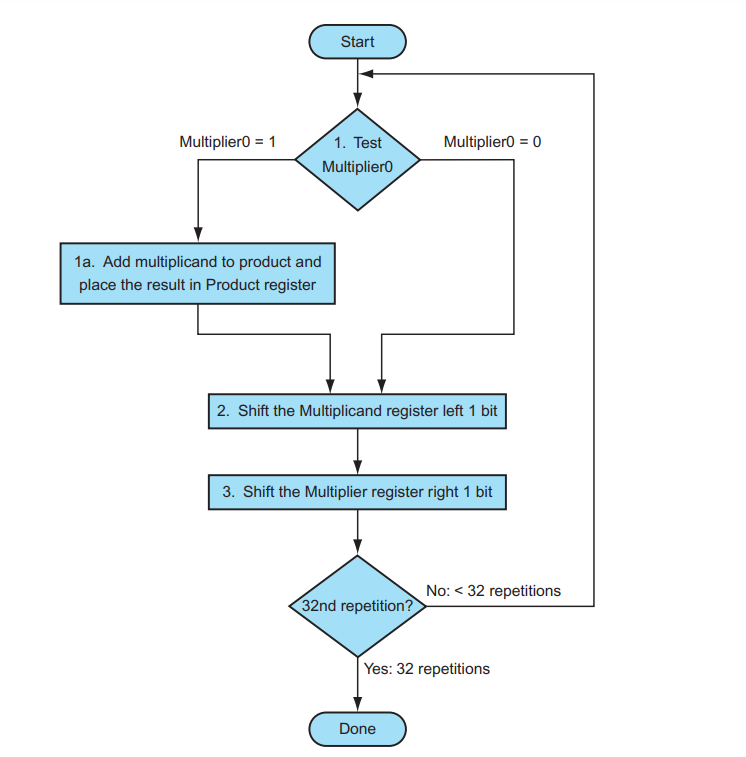
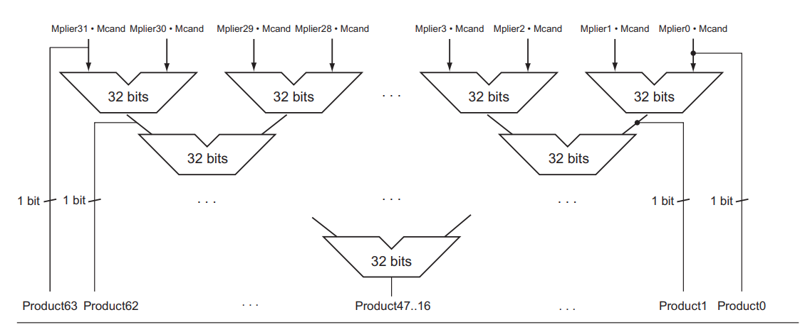

# Multiplication

## Terms

`Multiplicand` x `Multiplier` = `Product`

## Multiply by Hand

    0101 (5)
x   0010 (2)
--------------
    0000
   0101
  0000
 0000
--------------
 0001010  (10)

## Basic Implementation

### Hardware
- 64-bits Multiplicand register
- 32-bits Multiplier register
- 64-bits Product register
- 64-bits ALU


### Algorithm

```cpp

// init
// multiplicand into lower 32-bits of Multiplicand register
// multiplier into 32-bits of Multiplier register
// product = 0

// Iterate 32 times for 32-bits integers multiplication
for (i = 0; i < 32; i++) {
    // if most right bit of multiplier is 0
    if (multiplier[0] != 0) {
        // Add product with multiplicand
        product = product + multiplicand;
    }
    multiplicand = multiplicand << 1;
    multiplier = multiplier >> 1
}
```



### Example

0010 (2) x 0011 (3) = 0110 (6)

| Iteration | Step                           | Multiplier | Multiplicand     | Product     |
|-----------|--------------------------------|------------|------------------|-------------|
|           | Initial values                 | 0011       | 0000 0010        | 0000 0000   |
|-----------|--------------------------------|------------|------------------|-------------|
| 1         | 1 => prod += mcand             | 0011       | 0000 0010        | 0000 0010   |
|           | mcand << 1, mlier >> 1         | 0001       | 0000 0100        | 0000 0010   |
| 2         | 1 => prod += mcand             | 0001       | 0000 0100        | 0000 0110   |
|           | mcand << 1, mlier >> 1         | 0000       | 0000 1000        | 0000 0110   |
| 3         | 0 => do nothing                | 0000       | 0000 1000        | 0000 0110   |
|           | mcand << 1, mlier >> 1         | 0000       | 0001 0000        | 0000 0110   |
| 3         | 0 => do nothing                | 0000       | 0001 0000        | 0000 0110   |
|           | mcand << 1, mlier >> 1         | 0000       | 0010 0000        | 0000 0110   |

## Improving Implementation

### Hardware
- 32 bits Multicand register
- 64 bits Product/Multiplier register
- 32 bits ALU


### Algorithm

```cpp
// Init
// - multicand into 32 bits Multicand register
// - multiplier into lower 32 bits of 64 bits Product/Multiplier register
// - product init as 0 into upper 32 bits  of 64 bits Product/Multiplier register
//
// Result
// - After the multiplication, lower 32bit of Product/Multiplier register is the result
for (i = 0; i < 32; i++) {
    // if most right bit of multiplier is 0
    if (product_multiplier[0] != 0) {
        // Add product with multiplicand
        product = product + multiplicand;
    }
    product_multiplier = product_multiplier >> 1;
}
```

### Example

0010 (2) x 0011 (3) = 0110 (6)

| Iteration | Step                           | Multiplicand | Prod/MPlier  | 
|-----------|--------------------------------|--------------|--------------|
|           | Initial values                 | 0010         | 0000 0011    |
|-----------|--------------------------------|--------------|--------------|
| 1         | 1 => prod += mcand             | 0010         | 0010 0011    |
|           | prod/mlier >> 1                | 0010         | 0001 0001    |
| 2         | 1 => prod += mcand             | 0010         | 0011 0001    |
|           | prod/mlier >> 1                | 0010         | 0001 1000    |
| 3         | 0 => do nothing                | 0010         | 0001 1000    |
|           | prod/mlier >> 1                | 0010         | 0000 1100    |
| 3         | 0 => do nothing                | 0010         | 0000 1100    |
|           | prod/mlier >> 1                | 0010         | 0000 0110    |

## Signed Multiplication

Simple approach:
- Convert Multiplicand and Multiplier to positive number
- Do the multiplication
- Sign of the result is negative only if Multiplicand and Multiplier has different sign

The above algorithm also work for signed integer!!

Example:
1101 (-3) x 0010 (2) = 1010 (-6)

| Iteration | Step                           | Multiplicand | Prod/MPlier  | 
|-----------|--------------------------------|--------------|--------------|
|           | Initial values                 | 1101         | 0000 0010    |
|-----------|--------------------------------|--------------|--------------|
| 1         | 0 => do nothing                | 1101         | 0000 0010    |
|           | prod/mlier >> 1                | 1101         | 0000 0001    |
| 2         | 1 => prod += mcand             | 1101         | 1101 0001    |
|           | prod/mlier >> 1                | 1101         | 0110 1000    |
| 3         | 0 => do nothing                | 1101         | 0110 1000    |
|           | prod/mlier >> 1                | 1101         | 0011 0100    |
| 4         | 0 => do nothing                | 1101         | 0011 0100    |
|           | prod/mlier >> 1                | 1101         | 0001 1010    |

## Faster Multiplication

Rather than use a single 32-bit adder 31 times, this hardware “unrolls the loop” to use 31 adders and then organizes them to minimize delay
Instead of waiting for 32 add times, we wait just the log2(32) or five 32-bit add times.

In fact, multiply can go even faster than five add times because of the use of `carrysave adders`




## Overlow

The hardware can monitor the sign bit of the result to look for an overflow

Example:
1000 (-16) x 0010 (2)

| Iteration | Step                           | Multiplicand | Prod/MPlier  | 
|-----------|--------------------------------|--------------|--------------|
|           | Initial values                 | 1000         | 0000 0010    |
|-----------|--------------------------------|--------------|--------------|
| 1         | 0 => do nothing                | 1000         | 0000 0010    |
|           | prod/mlier >> 1                | 1000         | 0000 0001    |
| 2         | 1 => prod += mcand             | 1000         | 1000 0001    |
|           | prod/mlier >> 1                | 1000         | 0100 0000    |
| 3         | 0 => do nothing                | 1000         | 0100 0000    |
|           | prod/mlier >> 1                | 1000         | 0010 0000    |
| 4         | 0 => do nothing                | 1000         | 0010 0000    |
|           | prod/mlier >> 1                | 1000         | 0001 0000    |

The result is 0000, sign bit is `0`, the expect sign bit is `1` => overflow

## Multiplication in Different Hardware

### MIPS
MIPS provides a separate pair of 32-bit registers to contain the 64-bit product, called **Hi** and **Lo**.  
- **Instructions**:
  - `mult` (signed multiplication)
  - `multu` (unsigned multiplication)  
- To fetch the 32-bit lower part of the product:  
  - Use `mflo` (move from Lo).  
- To fetch the 32-bit upper part of the product:  
  - Use `mfhi` (move from Hi).

### ARM
ARM: Combines MUL (lower 64 bits) with SMULH/UMULH (upper 64 bits).
- **Instructions**:  
  - `MUL`: Performs 32-bit multiplication; stores only the lower 32 bits of the result.
  - `SMULL` (Signed Multiply Long) / `UMULL` (Unsigned Multiply Long): Produces a 64-bit result by combining two 32-bit registers.
  - `MLA` (Multiply-Accumulate): Performs multiplication and adds the result to an accumulator.

### x86
Uses RAX (lower 64 bits) and RDX (upper 64 bits).
- **Instructions**:  
  - **Unsigned Multiplication**:
    - `MUL`: Multiplies the operand with the accumulator; stores the result in `AX`/`EAX`/`RAX` for smaller values or splits it into `DX:AX`, `EDX:EAX`, or `RDX:RAX` for larger results.
  - **Signed Multiplication**:
    - `IMUL`: Similar to `MUL` but considers sign extension.
    - Supports immediate and memory operands for more flexible usage.
  - For 64-bit multiplications, `RDX:RAX` holds the full result, with `RDX` containing the high 64 bits.
