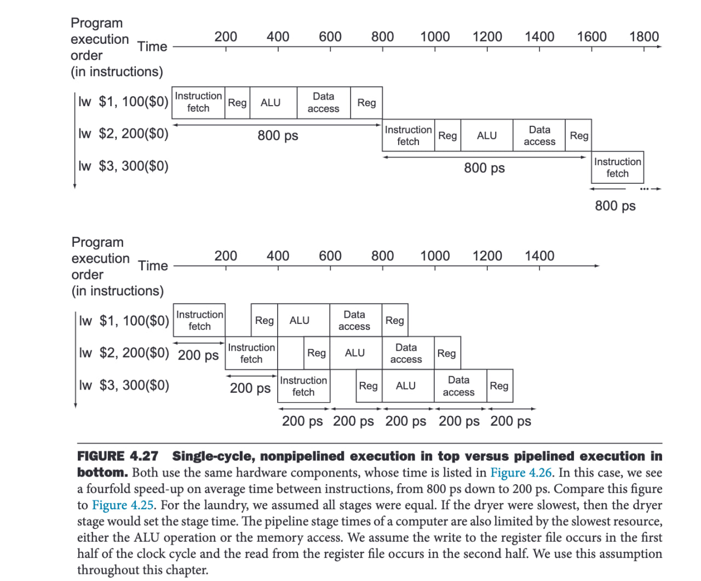
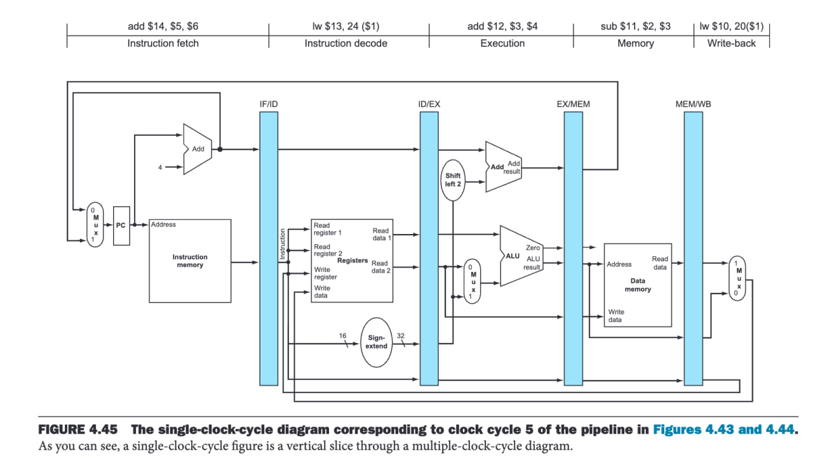
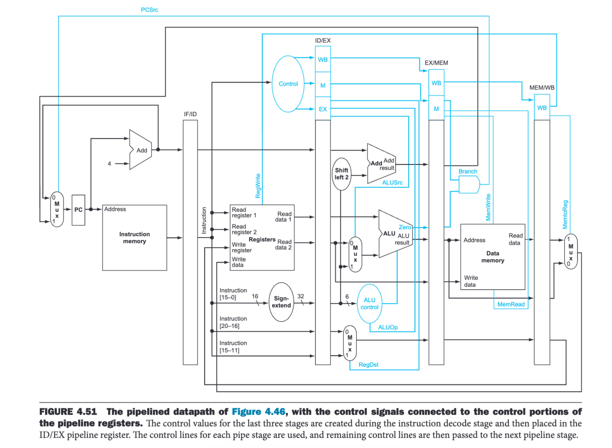
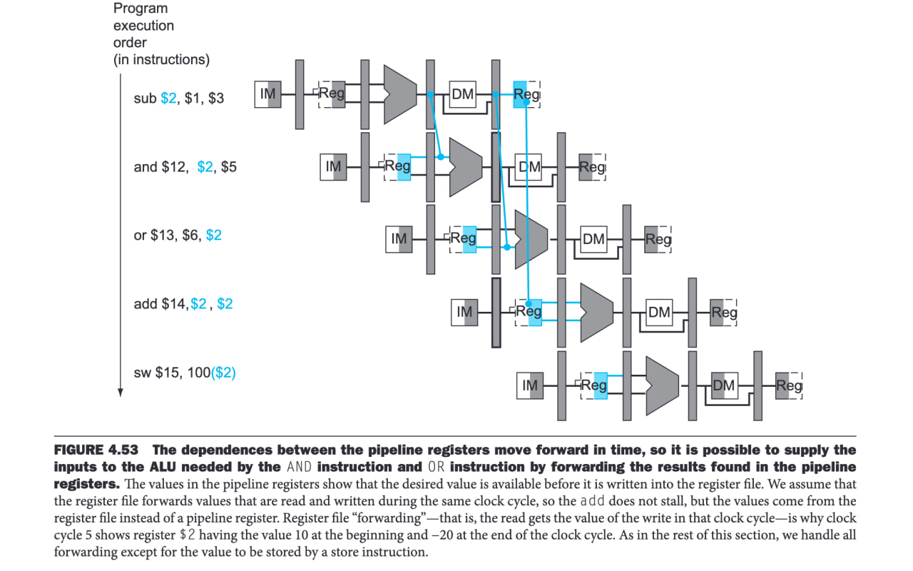
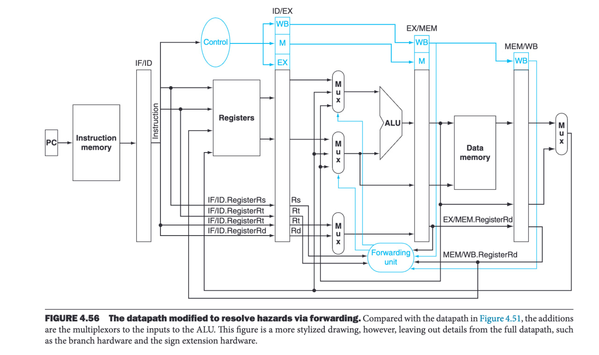
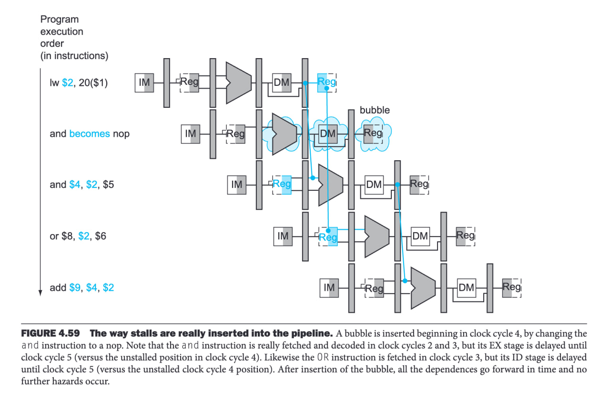
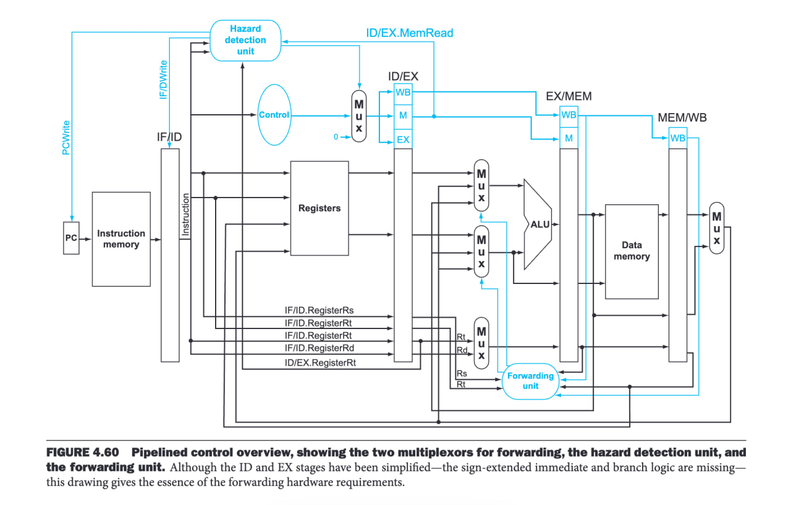

# Pipeline

## What is Pipeline?

Pipeline is a method used to implement processors so that each instruction executes in multiple stages. This allows multiple instructions to execute simultaneously instead of waiting for one instruction to finish before starting the next.

Pipeline improves overall processor throughput, even though the time to execute each instruction may be longer.

## How does Pipeline Work?

The execution of an instruction is split into multiple stages, example:

- Instruction Fetch (IF)
- Instruction Decode (ID)
- Execution (EX)
- Memory Access (MEM)
- Write Back (WB)

Each stage executes in one clock cycle, controlled by a clock edge detector and flip-flops (which act as gates to allow signals to pass to the next stage).

The data after each stage is stored in a stage register until the next clock cycle.



### Flow:
- Example there is a flip-flop is placed right after the PC (before the input line of the instruction memory block) - in the image, there is no flip-flop after PC but the data is go from EX/MEM register 
- **Clock Edge 1:** The flip-flop stores the instruction address from the PC and allows the signal from the PC to enter the instruction memory to fetch the instruction. The instruction data is stored in the IF/ID register, waiting for the next cycle.
- **Clock Edge 2:** The flip-flop after IF/ID allows data to pass from IF/ID to the ID block, decoding the instruction and storing the decoded data in ID/EX. Simultaneously, the next instruction is fetched in the IF block.
- This process continues for all stages, with a flip-flop placed after PC and after each stage register.
- The control signals for each instruction also stored in stage register (current stage of that instruction)





## Hazards - Problems in Pipeline Implementation

A hazard is a situation in pipelining where the next instruction cannot execute in the expected cycle due to dependencies or conflicts, leading to stalls or incorrect execution. Hazards can be categorized into three types: structural, data, and control hazards.

### Structural Hazards
Occurs when two instructions access (one read, one write) the same component (like registers or memory) at the same clock cycle.

**Solutions:**
- Split memory into separate instruction fetch and data memory blocks.
- Use a register file that allows reading in one half of the cycle (falling edge) and writing in the other half (rising edge).

### Data Hazards
Occurs when an instruction depends on the result of a previous instruction.

#### Case 1: Data needed right after ALU execution (ALU input dependency)
Example:
```assembly
add s1, s2, s3
sub s4, s1, s2  # s1 is needed from the previous instruction
```
**Solution:** Forward the ALU output back to the ALU input.



**Implementation:**
- Connect the ALU output back to the ALU input.
- Use multiplexers to select between register file input and forwarded data.
- A forwarding unit detects hazards and generates control signals to select the correct ALU input.



#### Case 2: Data needed from MEM stage (Load instruction dependency)
Example:
```assembly
load s1, 100(s2)
add s3, s1, s4  # s1 is needed from the previous instruction
and t1, t2, t3
```
**Solution:** Stall the pipeline by delaying execution of the dependent instruction.



**Implementation:**
- Forward MEM Read signal to the Forwarding Unit.
- Forward MEM data output to the input line of ALU (into the multiplexor).
- Implement stall/bubble:
  - A hazard detection unit detects load hazards.
  - If a hazard is detected, control signals to ID/EX are set to zero (NOP), stalling execution.
  - The IF/ID register is also stalled to delay the next instruction.
  - When the load completes, execution resumes normally.



### Control Hazards
Occurs with conditional branches where the next instruction is unknown until the branch result is calculated.

Example:
```assembly
bne s1, s2, 100
add t1, t2, t3
...
100: load t1, 100(t4)
```

**Solutions:**
- **Stall the pipeline** until the branch result is known (slow).
- **Static prediction:** Always predict taken or not taken.
  - If correct, continue as normal.
  - If incorrect, flush all executed instructions after the branch.
- **Dynamic prediction:** Use history-based prediction (e.g., 1-bit or 2-bit branch history).
- **Delayed branching:** Place independent instructions after the branch to execute while the branch decision is made (usually compiler level)

#### How to Flush Changes on Misprediction
If a branch misprediction occurs:
1. Identify instructions in the pipeline after the branch.
2. Set all their control signals to zero (convert them to NOPs).
3. Reset the PC to the correct branch target.
4. Restart execution from the correct instruction.

