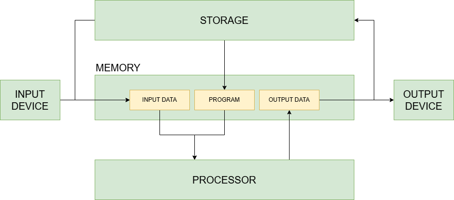

# Computer

## What is a Computer?
A computer is a programmable electronic device designed to process **[data]** and perform tasks by executing **[programs][program]**.
It can handle a wide range of operations, from simple calculations to complex **[data]** analysis, based on the instructions provided.

**Types of Computers**:
- Personal Computers (PCs)
- Servers
- Supercomputers
- Embedded Computers
- Personal mobile devices (PMDs)
- Cloud

## How a Computer Processes Data
For a computer to process **[data]**, the following steps are involved:
1. **Define the Data to Process**: Represent the **[data]** in a binary format that the computer can understand.
2. **Create a [Program][program]**: Write a set of **[instructions][instruction]** (a **[program]**) that describes how the **[data]** should be processed.

### Data Processing Workflow:
1. **Input Data**: **[Data]** is loaded into **[memory]** from an **[input device][indevice]** (e.g., keyboard, mouse) or a **[file]** in **[storage]**.
2. **Program Loading**: The program is also loaded into **[memory]**.
3. **Execution**: The **[processor]** fetches **[data]** and **[instructions][instruction]** from **[memory]** and executes them.
4. **Output Data**: The processed data is written back into **[memory]**.
5. **Output Presentation**: The output data can be written into **[storage]** (as **[files]**) or read by an **[output device][outdevice]** (e.g., monitor, printer) to present it to the user.



### Basic Components of a Computer
- **[Input Device][indevice]**: Used to provide input data to the computer (e.g., keyboard, mouse, microphone).
- **[Storage]**: Stores data and programs permanently (e.g., HDD, SSD).
- **[Memory]**: Temporarily stores data and programs that are currently being used for processing.
- **[Processor]**: Executes instructions to process the data.
- **[Output Device][outdevice]**: Reads data from memory and presents it to the user (e.g., monitor, speaker, printer).

### Other Important Components
- **[Graphics Processing Unit (GPU)][gpu]**: Handles graphics rendering and parallel processing tasks.
- **[Power Supply Unit (PSU)][psu]**: Provides power to the computer system.
- **[Cooling System][cooling-system]**: Prevents overheating by dissipating heat (e.g., fans, heat sinks).
- **[Network Interface Card (NIC)][nic]**: Enables network connectivity.

### Example: Extracting Sentences with a Keyword
A computer [program] to extract all sentences in a text document that contain a keyword:
1. **Data to Process**: A text document and a keyword, represented in binary as **[string]**.
2. **Program**: Instructions to find all sentences containing the keyword.
3. **Execution**:
   - The [program] is loaded into [memory].
   - The input text document is loaded into [memory] from an input device or [storage].
   - The processor executes the [program], identifying sentences with the keyword.
   - The output is displayed on a screen or saved to [storage].

## How is a Computer Made?
1. **Silicon**: Used to make **[transistors][transistor]**, which act as tiny electronic switches.
2. **[Transistors][transistor]**: Combined to form **[logic gates][logic-gate]** (e.g., AND, OR, NOT).
3. **[Logic Gates][logic-gate]**: Used to build **[circuit blocks][circuit-block]** like **[decoder], [multiplexer], [ALU], and [register]**.
4. **[Circuit Blocks][circuit-block]**: Form **core components** such as **[CPU][processor], [RAM][ram], [GPU], and [controllers]**.
5. **[Integrated Circuits (ICs)][IC]**: Core components are fabricated into microchips.
6. **[Motherboard]**: [ICs][IC], [storage], [cooling systems][cooling-system], and I/O ports are assembled onto a **motherboard**.

### Performance of a Computer

Performance is how efficiently it can execute tasks, often measured by how quickly it can complete a given workload.
The most important metric is **CPU execution time**.

**CPU execution time** is the time the [CPU] spends computing for a specific task

```c
// CPU_EXECUTION_TIME: CPU execution time for a program
// NUMBER_OF_CLOCK_CYCLE: total number of clock cycles of this program
// CLOCK_CYCLE_TIME: Time of a clock cycle of the CPU
CPU_EXECUTION_TIME = NUMBER_OF_CLOCK_CYCLES * CLOCK_CYCLE_TIME;

// NUMBER_OF_INSTRUCTION: total number of instructions of this program
// CPI: Average number of clock cycles per instruction (each type of instruction has different clock cycles needed to execute)
NUMBER_OF_CLOCK_CYCLES = NUMBER_OF_INSTRUCTION * CPI;
```

`NUMBER_OF_INSTRUCTION` is affected by the code, [ISA] and [compiler]
`CPI` and `CLOCK_CYCLE_TIME` is affected by the implementation of the hardware (processor)

### Computer History

- Before 1800s: Mechanical Calculators
- 1800s - Early 1900s: Mechanical Computers
- 1930s - 1940s: Early Electronic Computers (with vacuum tubes)
- 1947: [Transistor]
- 1958: [Integrated Circuit][IC]
- 1970s - 1980s: Personal Computers
- 1990s: [The Internet][Internet]
- 2000s - Present: Mobile computers, Cloud, AI

As processors become faster and more powerful, they consume significantly more energy.
Traditionally, higher clock speeds (smaller time to execute task) and smaller [transistors][transistor] (more transistors = more computational units) helped improve performance, but they also led to increased power usage and heat dissipation issues.

=> The shift to [multi-core processor][core] has become more prevalent.

[Multi-core processors][core] enhance performance while maintaining energy efficiency. To fully utilize multiple processors, programs must be designed for parallel execution. However, this introduces challenges such as synchronization, data sharing, and workload distribution.

[data]:                 data/Data
[string]:               data/text/Text
[program]:              program/Program
[instruction]:          program/instruction/Instruction
[storage]:              components/storage/Storage
[memory]:               components/memory/Memory
[RAM]:                  components/memory/ram/RAM
[indevice]:             components/input-devices/InputDevice
[outdevice]:            components/output-devices/OutputDevice
[processor]:            components/processor/Processor
[CPU]:                  components/processor/Processor
[logic-gate]:           components/processor/functional-units/logic-gate/LogicGate
[circuit-block]:        components/processor/functional-units/circuit-block/CircuitBlock
[GPU]:                  components/gpu/GPU
[PSU]:                  components/psu/PSU
[NIC]:                  components/network/NIC
[cooling-system]:       components/cooling-system/CoolingSystem
[file]:                 operating-system/file-system/File
[IC]:                   components/ic/IntegratedCircuit
[transistor]:           components/processor/functional-units/transistor/Transistor
[motherboard]:          components/motherboard/Motherboard
[decoder]:              components/processor/functional-units/decoder/Decoder
[multiplexer]:          components/processor/components/multiplexer/Multiplexer
[ALU]:                  components/processor/components/alu/ALU
[register]:             components/processor/components/register/Register
[ISA]:                  program/instruction/isa/ISA
[compiler]:             program/compiler/Compiler
[core]:                 components/processor/components/core/ProcessorCore
[Internet]:             network/TheInternet
