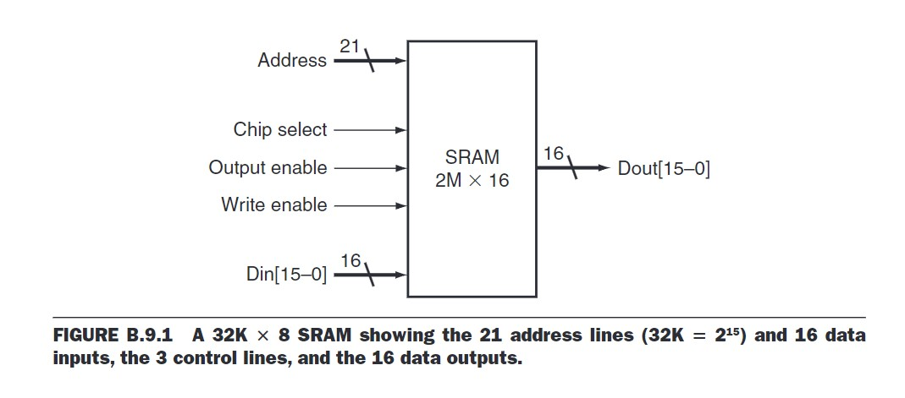
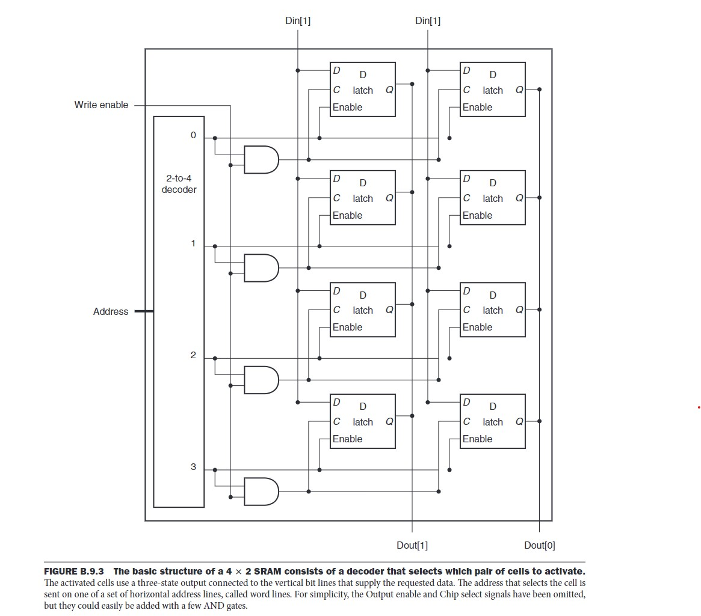
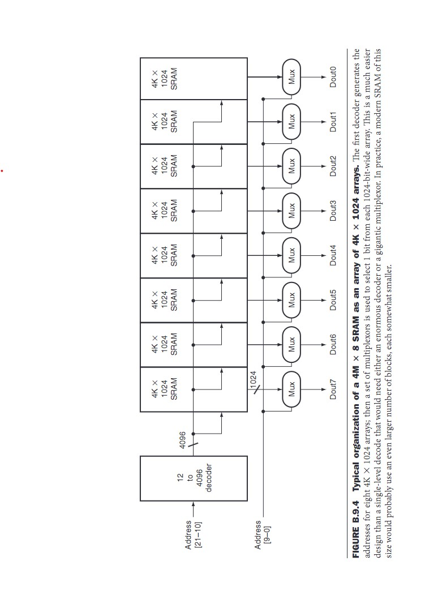
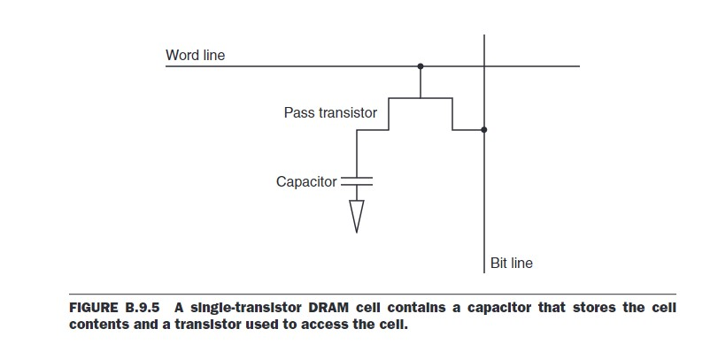
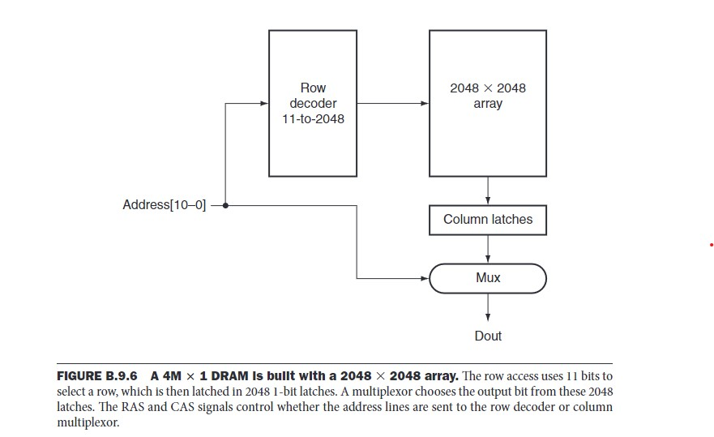

# Random Access Memeory (RAM)

**RAM (Random Access Memory)** is a type of **volatile** memory (lost when turn off the computer) that allows data to be read and written in any order, providing fast access to the processor.
It is used to store data that is actively being used or processed by the computer.

**RAM** is a sequential logic block (memory element), with:
- **Input**:
    - **Address Bus**: Address of the data.
    - **Data Bus**: Data for the write operation.
    - **Write Enable**: Control signal for write operation
    - **Output Enable**: Control signal for read operation
    - **Chip Select**: Signal used to select the RAM chip for communication. Since a system may have multiple memory chips connected to the same data and address lines, the Chip Select (CS) ensures that the correct chip is active and accessible during a memory read or write operation.
- **Output**: Data bus for the write operation

Unlike registers, RAM in general has a much larger address space, so using a single large multiplexer is ineffective. Instead, RAM cells are ogarinzed as a grid of cell, the input address will contains the info of row & col of the cell to read/write.

## Static RAM (SRAM)

- Uses **flip-flops** to build each cell (each flip-flop stores 1 bit of data).
- Number of transistors to build 1 cell: **4-6 transistors** (higher cost compared to DRAM).
- Mainly used for **cache memory** in CPUs.
- Data stored in SRAM is stable because the voltage level is maintained in flip-flops, meaning **no refresh is needed** (hence called **"STATIC"**).
- SRAM is usally organized as rectangular arrays and uses a **two-step decoding process** (address decoding).

### Read process
- A part of the address is decoded to select the appropriate row
- Other part of the address is decoded to select the appropriate col

### Write process
- The address is decoded, and data is written into the selected SRAM cell.

## Dynamic RAM (DRAM)

- Each cell is built using a **capacitor** to store data (charged = 1, discharged = 0).
- Each cell uses a **pass transistor** as a switch to support read/write operations (lower cost compared to SRAM). The transistor inside the DRAM cell acts as a switch that connects the capacitor (which holds the data) to the bit line.
- The charge inside the capacitor discharges over time, making it unstable. To maintain data integrity, DRAM needs to **refresh** at regular intervals. => slower
- A **read operation** can cause the charge in the capacitor to change, so **refreshing** is also required right after a read operation to restore the data.

### Read process

The idea is detecting a very small charge stored in the capacitor convert it to voltage level to output

Before activating the word line for a read, the bit line is charged to the voltage that is halfway between the low and high voltage.

Then, by activating the word line, the charge on the capacitor is read out onto the bit line. This causes the bit line to move slightly toward the high or low direction, and this change is detected with a sense amplifier, which can detect small changes in voltage (this amlifier is not a part of the cell but located in a peripheral circuit within the DRAM chip)

The output signal of all column (of the activated row/wordline) then stored into the column latches, then go through a MUX to select the right bit.

After select the right bit from column latches, the data (of selected bit) is writed back into the cell (cell refresh)

### Write process

The pass transistor acts like a switch: when the signal on the word line is asserted, the switch is closed, connecting the capacitor to the bit line.

When the operation is a write, then the value to be written is placed on the bit line.
- If the value is a 1, the capacitor will be charged. 
- If the value is a 0, then the capacitor will be discharged

### **Refresh Process**

Refresh is the process of recharging the capacitors to preserve the data stored in them.

- The **memory controller** manages the refresh process by initiating it at **fixed intervals**.
- **Refresh does not happen all at once**, but rather **row-by-row**.

#### **Steps of the Refresh Process**:
1. The memory controller sends an **activate signal** to the **row address**.
2. The data from the row is **read out onto the bit lines**. This temporarily disturbs the charge in the capacitor.
3. The data is immediately **written back** to the same row, effectively **recharging** the capacitors to preserve the data.
4. After one row is refreshed, the **next row** is selected for refresh in the **next cycle**.
