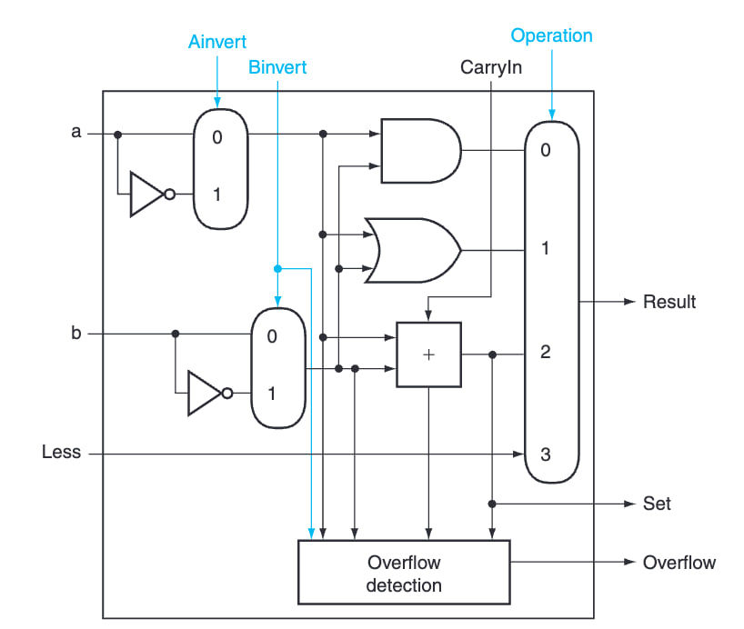
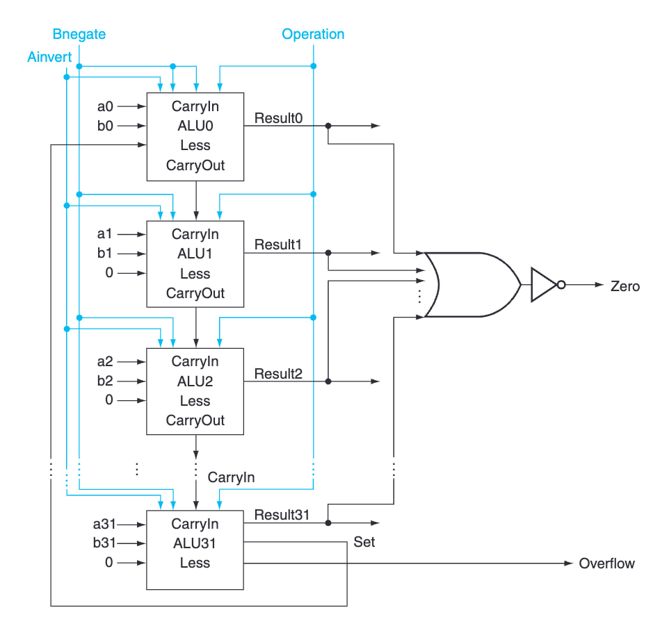
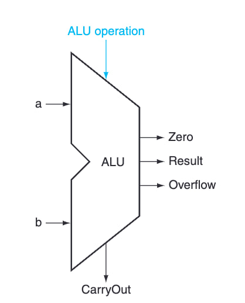

# Arithmetic Logic Unit (ALU)

## What is an ALU?

An ALU (Arithmetic Logic Unit) is a combinational logic circuit inside a processor that takes inputs and control bits, performs arithmetic (addition, subtraction) and logic (AND, OR, NOT, etc.) operations, and produces an output.

## How does an ALU work?

An **n-bit ALU** consists of **n connected 1-bit ALUs**, where each 1-bit ALU has two operand inputs, a 2-bit operation control, `AInvert`, `Bnegate` (used for both `CarryIn` and `BInvert`), and produces a result and carry-out. 

The n-bit ALU takes two n-bit inputs and control bits (`Operation`, `AInvert`, `BInvert`, `CarryIn`), then produces an n-bit result, a zero flag (set if the result is 0), a carry-out bit, and an overflow detection bit.

## How to create an ALU

1. **Design a 1-bit ALU**:
   - Create a truth table for all required logic and arithmetic operations.
   - Derive the logic functions from the truth table.
   - Implement the circuit using logic gates.
   - Use a **multiplexer** to select the correct operation based on the control bits.

2. **Build an n-bit ALU**:
   - Connect **n** 1-bit ALUs in a chain, where the output of one ALU serves as the input for the next.
   - Add additional blocks such as **zero detection** and **overflow detection**.

3. **Optimize for speed**:
   - Apply optimizations such as **carry-lookahead adders** to improve performance.
   - Reduce propagation delay by refining the circuit design.
