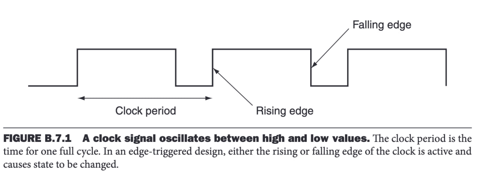
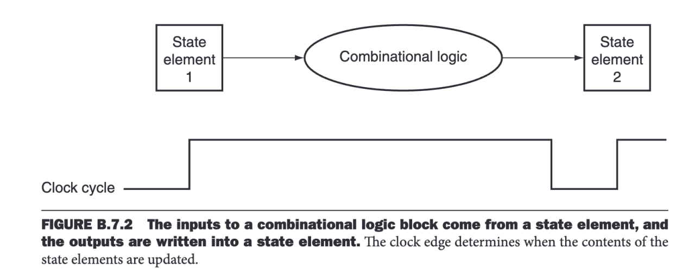
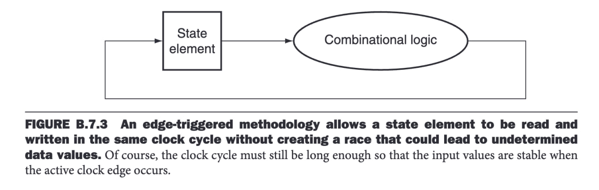

# Clock

## What is a Clock?

A clock is a free-running signal with a fixed cycle time. The clock frequency is simply the inverse of the cycle time. The clock cycle time or clock period is divided into two portions: when the clock is high and when the clock is low.

### Clock in Processors:
- Controls **instruction execution** in pipelines using flip-flops to allow signals to travel to the next block on a clock edge.
- Synchronizes **memory access** and data transfer, writing data on the clock edge.

### Key Characteristics:
- **Clock Pulse:** A periodic signal that alternates between high (1) and low (0).
- **Clock Cycle:** The time interval between two consecutive rising or falling edges of the clock signal.
- **Frequency:** The number of clock cycles per second, measured in Hertz (Hz).
- **Duty Cycle:** The ratio of time the clock remains high versus the total cycle duration.

## How Does a Clock Work?

Clocks are essential in sequential logic to determine when an element containing state (sequential logic) should be updated. In an edge-triggered clocking methodology (one of the common clocking methodologies), either the rising edge or the falling edge of the clock is active and causes state changes to occur. The state elements in an edge-triggered design are implemented so that their contents change only on the active clock edge.

State elements, whose outputs change only after the clock edge, provide valid inputs to the combinational logic block. To ensure that the values written into the state elements on the active clock edge are valid, the clock must have a long enough period so that all signals in the combinational logic block stabilize. The clock edge then samples those values for storage in the state elements. This constraint sets a lower bound on the clock period length, ensuring it is long enough for all state element inputs to be valid.

### Process Overview:
1. A clock generator produces a continuous pulse signal.
2. An edge detector identifies rising or falling edges (active events) of the clock and signals all sequential logic blocks to update their state.
3. The clock cycle time is designed to be long enough so that the combinational logic block, which receives the new state from sequential logic blocks, has sufficient time to process the signal and generate a stable output before the next rising or falling edge occurs. This output then becomes the valid input for the next block.

