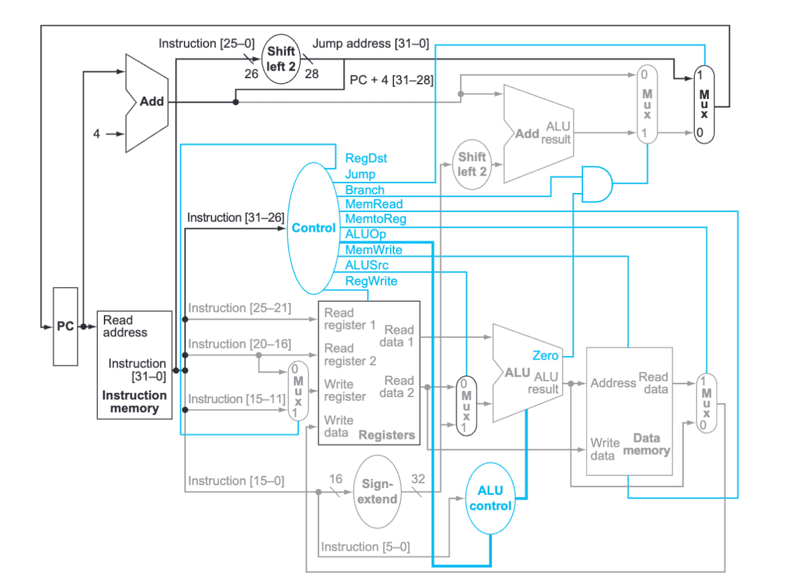

# Core

## What is a Core?

A core inside a processor is an independent processing unit that executes instructions. It acts like a mini-processor within the main processor, capable of performing its own fetch-decode-execute cycle.

## How does a Core Execute Instructions?

Instruction Executeion follows the **Instruction Cycle**, which consists of three main stages:
- Fetch → Get instruction from memory.
- Decode → Figure out what the instruction does.
- Execute → Perform the operation. 

## How to Build a Core
- Using `Transistors` to build `Logic Gates` (AND, OR, NOT, XOR) 
- Using `Logic Gates` to build basic funtional units - blocks (`Decoder`, `MUX`, `ALU`, etc)
- Using these basic funtional units to form a final block that can execute all supported instructions defined in the target ISA

### How to Form the Final Block

#### 1. Assemble the Execution Pipeline:
Using basic funtional units to form these units in the execution pipeline:
- **Instruction Fetch Unit** → Retrieves instructions from memory.  
- **Decode Unit** → Deciphers instructions and determines operands.  
- **Execution Unit (ALU, FPU, etc.)** → Performs arithmetic, logic, and floating-point operations.  
- **Memory Access Unit** → Reads/writes data to memory when required.  
- **Write-Back Unit** → Stores results in registers or memory.  

#### 2. Integrate Control Logic & Registers:
Integrate/combine above units and add control unit & register
- **Control Unit (CU)** → Directs data flow and instruction timing.  
- **Registers** → Store temporary values and instruction operands.  
- **Branch Predictor** → Optimizes jumps and decision-making logic.  

#### 3. Optimize with Additional Features:
Optimization:
- **Pipeline Stages** → Enable overlapping execution of multiple instructions.  
- **Cache Memory (L1, L2, L3)** → Speed up access to frequently used data.  
- **Parallel Execution (Superscalar, Out-of-Order Execution)** → Improve efficiency.  

### Example: MISP single core processor implementation

This is a simple implemetation for basic instructions in MISP. Include:
- Data transfer instruction: load/store
- Arithmetic: add/sub
- Branch: condition branch

Its include all needed blocks to fetch, decode, execute above instructions
