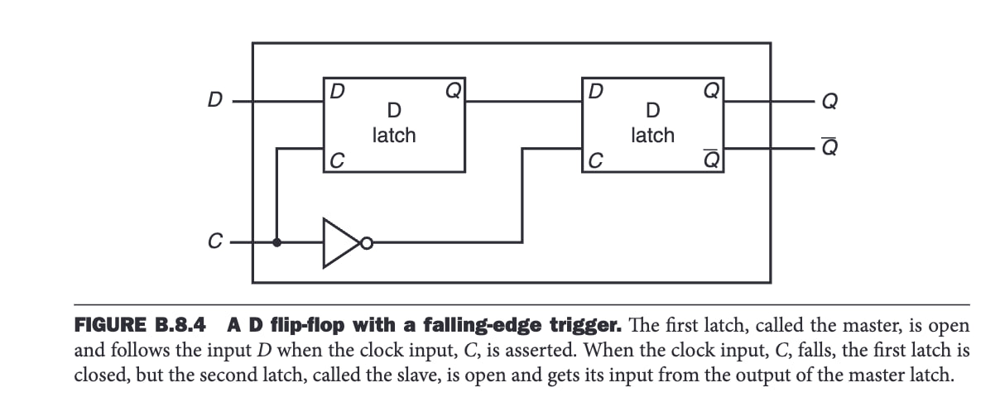
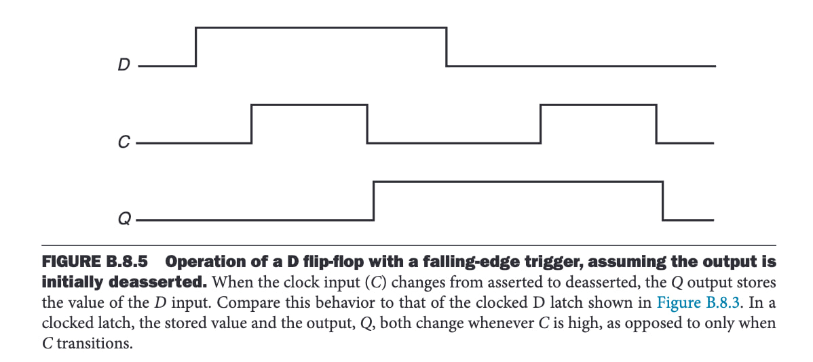
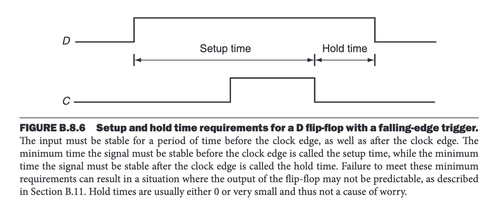

# Flip-Flop

## What is a Flip-Flop?

A flip-flop is a memory element (a sequential logic block that stores data) built from latches. Unlike latches, flip-flops store data based on a **Clock Edge Signal** (instead of a continuous clock signal).

Flip-flops are used to:
- Build more complex memory components such as registers, RAM, etc.
- Control the processor pipeline by allowing data to flow to next block according to the clock edge signal.

The data (memory/state) stored in a flip-flop (or any memory element), as well as its output, is represented by an **electric voltage level** (high or low).

A Flip-flop store 1 bit of data.

## How Does a Flip-Flop Work?

A **D Flip-Flop** is constructed using two **D-Latches** and takes input **C** from the **Clock Edge Signal**:

1. When a **clock edge detector** detects a clock edge, it sends a **momentary 1 signal** to the **C input** line.
2. The data **D** is then stored in the **first D-Latch** and appears at its output **Q**.
3. The data waits at the **D line of the second D-Latch**, as the inverted **C input** is currently **0**.
4. Right after the clock edge occurs, the edge detector signal returns to **0**, causing the data to be stored in the **second D-Latch** and appear at its output **Q** (which is also the final **Q output** of the D Flip-Flop).

### Setup and Hold Time Requirements

For the flip-flop to function correctly, the input **D** must remain stable during the following periods:
- **Setup Time:** The time from just **before** the clock edge until the clock edge occurs. This ensures **D** is correctly stored in the first latch.
- **Hold Time:** The time from just **after** the clock edge until the second D-Latch stabilizes. This ensures **D** is correctly stored in the second latch.

