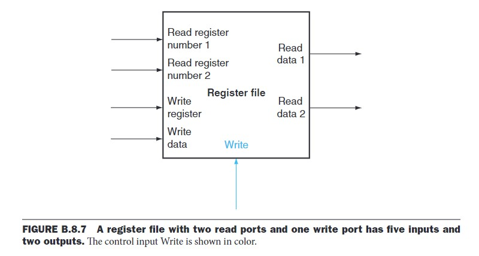
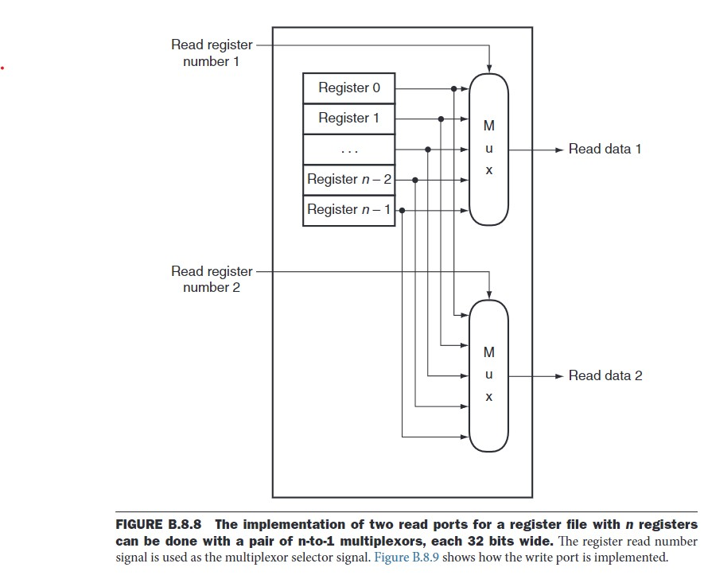
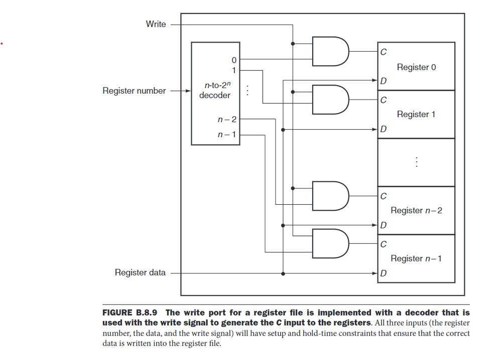

# Register File

## What is a Register File?

A **Register File** is a sequential logic block (a memory element) used to store and provide fast access to multiple registers in a processor. 

It takes **register numbers** (including read and write registers) and **write data** as inputs, along with a **write signal** to control read and write operations. The output consists of the stored data from the selected registers during a read operation.

## How does a Register File work?

A Register File is built using flip-flops, all sharing the same control input line.

For example, in a Register File containing **8 registers**, each **32-bit wide**, every bit is stored in an individual flip-flop.

### Read Operation

For the **read ports**, the input consists of register numbers that specify which registers to read. These numbers act as selection signals for a **multiplexer**, which determines which register's data will be output.

### Write Operation

For the **write port**, the **data input line** connects to all registers. The **register number input** is passed through a **decoder** to generate a signal for the target register. This signal is then combined with the **write control signal** using an **AND gate** and connected to the **clock edge control signal** of each flip-flop, ensuring data is written at the correct moment.

