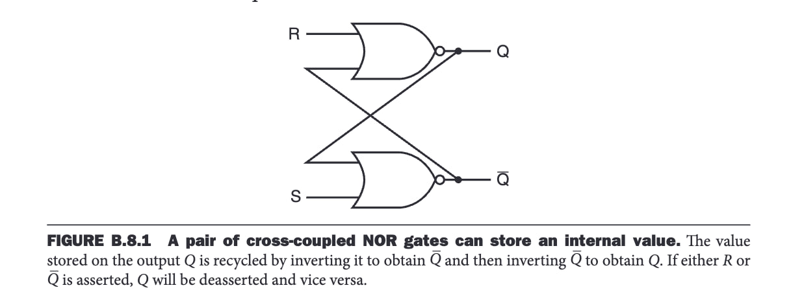
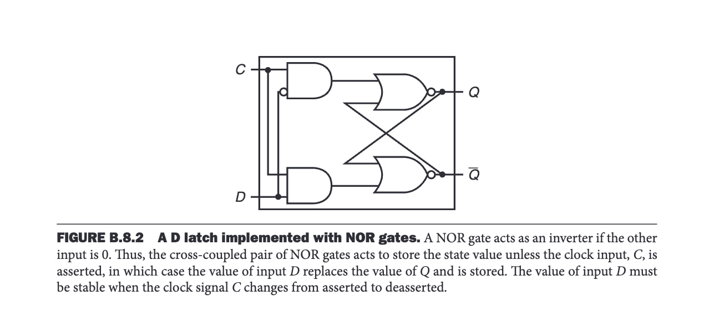
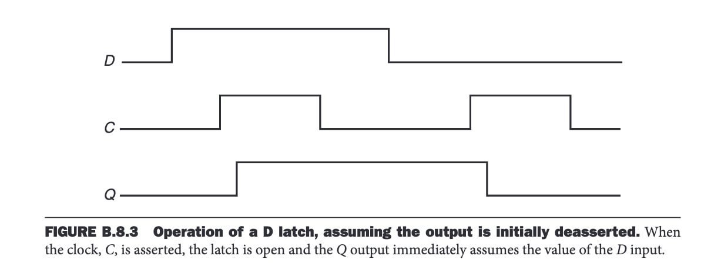

# Latch

## What is a Latch?

A latch is a basic memory element (a sequential logic block that contains memory).

It can be used to build more complex memory components such as flip-flops, registers, RAM, etc.

The data (memory/state) stored in a memory element, as well as its output, is represented by an **electric voltage level** (high or low).

### Types of Latches
- **S-R Latch (Set-Reset Latch):** The simplest latch, **unclocked** (does not have a clock input to control state changes).
- **D Latch:** Data input (**D**) is stored/written to internal memory when the clock input (**C**) is high (1).

## How Does a Latch Work?

### S-R Latch

An S-R latch has two inputs, **S (Set)** and **R (Reset)**, and produces two outputs, **Q** and **Q' (inverted Q)**:
- **R = 0, S = 0:** The latch retains its previous value, and **Q** remains unchanged.
- **R = 1, S = 0:** The latch stores **0** (reset), and **Q** outputs 0.
- **R = 0, S = 1:** The latch stores **1** (set), and **Q** outputs 1.
- **R = 1, S = 1:** **Invalid state**, as both **Q** and **Q'** become 0 (which is contradictory).

An S-R latch can be built using different methods, one of which involves **a pair of cross-coupled NOR gates**.

### D Latch

A **D-Latch** has two inputs: **D (Data to be stored)** and **C (Clock Signal - Continuos signal)**, and produces two outputs **Q** and **Q'**:
- **C = 1:** The value of **D** is stored in the latch and reflected on **Q**.
- **C = 0:** The latch holds its previous state, and **Q** remains unchanged.

A D-latch is typically built using an **S-R latch** with additional **AND gates** to control inputs.

