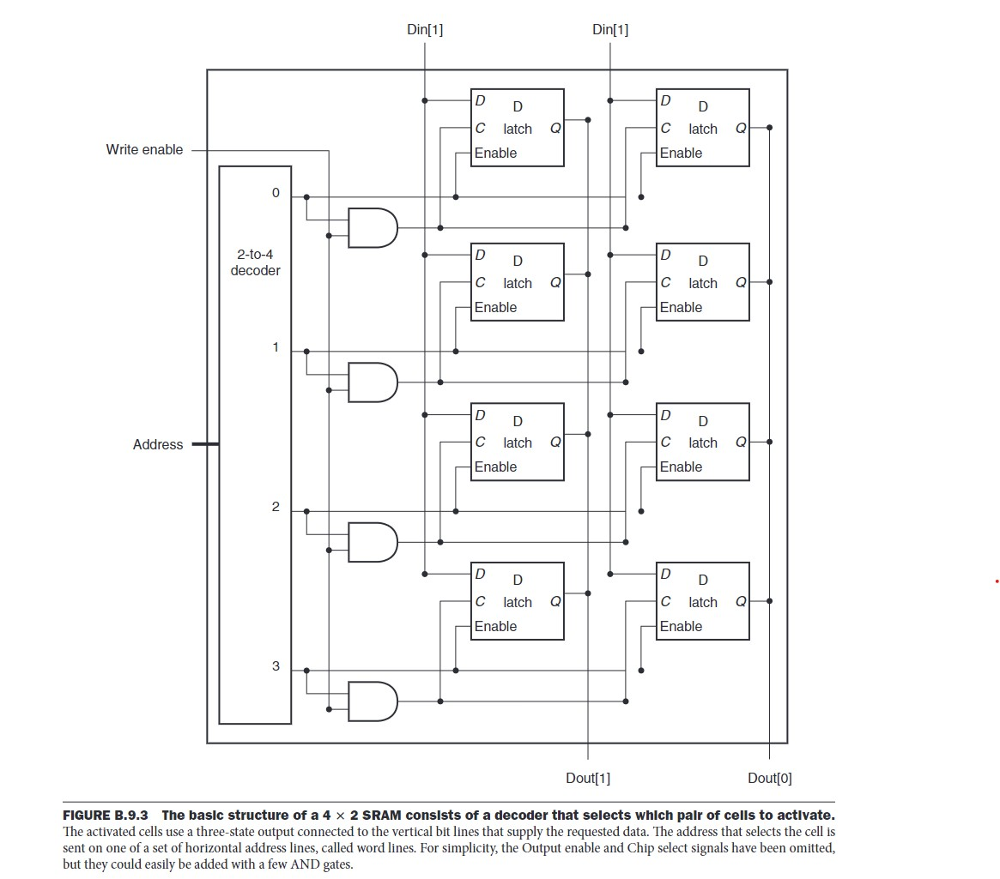

# Random Access Memeory (RAM)

**RAM (Random Access Memory)** is a type of **volatile** memory (lost when turn off the computer) that allows data to be read and written in any order, providing fast access to the processor.
It is used to store data that is actively being used or processed by the computer.

Unlike registers, RAM in general has a much larger address space, so using a single large multiplexer is ineffective. Instead, RAM cells are ogarinzed as a grid of cell, the input address will contains the info of row & col of the cell to read/write.

There are 2 type of RAM: Static RAM (SRAM) and Dynamic RAM (DRAM)

## Static RAM (SRAM)

- Uses **flip-flops** to build each cell (each flip-flop stores 1 bit of data).
- Number of transistors to build 1 cell: **4-6 transistors** (higher cost compared to DRAM).
- Mainly used for **cache memory** in CPUs.
- Data stored in SRAM is stable because the voltage level is maintained in flip-flops, meaning **no refresh is needed** (hence called **"STATIC"**).
- SRAM is usally organized as rectangular arrays and uses a **two-step decoding process** (address decoding).

### **Input Lines:**
- **Address Lines (A0, A1, ... An)**: Used to select a specific memory location.
- **Data Input Lines (DQ or I/O Pins)**: Carry data to be written into the memory cell.
- **Control Signals:**
  - **WE (Write Enable)**: If `LOW`, data is written into the selected memory location.
  - **CE (Chip Enable)**: Activates the SRAM chip. If `HIGH`, the chip is disabled.
  - **OE (Output Enable)**: Enables the data output drivers. If `LOW`, data is placed on the output lines for reading.
  - **Clock Signal (for synchronous SRAM)**: Synchronizes read/write operations with the system clock. (Not present in asynchronous SRAM.)

### **Output Lines:**
- **Data Output Lines (DQ or I/O Pins)**: Carry the data read from the memory cell. These are the same lines as the input lines, as it is a bidirectional data bus.
- **Status Signals (optional)**: Indicate the ready/busy state for certain operations.

### Read process
**Process for reading 1-bit data:**
  - The input address is divided into row and column.
  - The row and column input is decoded and combine with the output line of flip-flops (cells) to seletect the right bit

### Write process
**Process for writing 1-bit data:**
  - The input address is divided into row and column.
  - The input data signal is connect to all flip-flops (cells) and wait for control signal (to write)
  - The row and column input is decoded and combine with the Write Enable signal, then connect to the control line of all flip-flops
  - The seleted cell will has control line ON, allow data to write into the flip-flop

## Dynamic RAM (DRAM)

Each DRAM cell is **not** a complete logic block like a flip-flop. Instead, it consists of:
- **A capacitor**: stores the charge representing 1 or 0.
- **A transistor**: acts as a switch, allowing access to the capacitor for reading or writing, called **pass transistor**

DRAM cells are organized in a grid structure using:
- **Word Lines (Rows)**: Control lines that connect to the **pass transistors** in each row.
- **Bit Lines (Columns)**: Vertical lines connected to the capacitors via **pass transistors**.
- **Sense amplifier**: Add the end of each bit line, there is a sense amplifier used to sense a small voltage difference in bit line and amplify this signal to HIGH or LOW (used in read operation), and drives the bit line to the correct voltage (to restore the charge in capcitor in refresh operation)

The charge inside the capacitor discharges over time, making it unstable. To maintain data integrity, DRAM needs to **refresh** at regular intervals make it slower than SRAM

### **Input Lines:**
- **Address Lines**: Used to select the row and column of the memory cell.
  - **Row Address** is sent first (RAS - Row Address Strobe).
  - **Column Address** is sent next (CAS - Column Address Strobe).
- **Data Lines (DQ Pins)**: Carry data to be written into the selected memory cell.
- **Control Signals:**
  - **RAS (Row Address Strobe)**: Activates the selected row.
  - **CAS (Column Address Strobe)**: Activates the selected column.
  - **WE (Write Enable)**: Determines if data is being written (`1` to write, `0` to read).
  - **CS (Chip Select)**: Activates the DRAM chip. If `HIGH`, the chip is disabled.
- **Clock Signal (in synchronous DRAM like SDRAM, DDR)**: Synchronizes data transfer with the system clock.

### **Output Lines:**
- **Data Lines (DQ Pins)**: Carry the data read from the selected memory cell (this is the same line as the data input line)
- **Status Signals**: Indicate when the DRAM is ready for the next operation (e.g., Ready/Busy signals).

### Read process

**Process for reading 1-bit data:**
- All the bit lines/data lines are precharged to the voltage that is halfway between the low and high voltage.
- The input address is decoded into **row and column signal**
- The **row signal** activates the selected row (**word line**) by applying a voltage to the gate of the pass transistor, turning on the pass transistors for the selected row and connecting the capacitor (which holds the data bit) to the corresponding bit line.
- The charge stored in the capacitor causes a small voltage shift on the bit line (due to electrons move from high to low voltage region). This shift is typically quite small and may not be enough to be reliably detected directly.
- This shifted signal is then go through a **sense amplifier** (placed at the end of the bit line) which compare the voltage on the bit line to a reference voltage
- The **sense amplifier** then amplifies the small voltage difference, making the signal either HIGH or LOW depending on the charge on the capacitor.
- The signals of all bit lines of seleteced row then stored into **column latches**.
- The output lines of **column latches** is connected to a MUX to select correct bit with **column signal**, complete the read operation
- After the read, a refresh operation immediately follows to refresh to seleted row (Because during a read operation, the charge stored in the capacitor is transferred to the bit line. This can disturb or degrade the charge on the capacitor, making the stored data unreliable.)

**Reasons for Using Column Latches instead of directly connect bit lines with column MUX**:
- The bit line signals can change quickly and might still be settling after the sense amplifier amplifies them. The column latches buffer the bit line signals, allowing time for the data to stabilize and ensuring that the MUX receives a clean, stable signal.
- Column latches decouple the process of reading from the actual output selection. This allows the system to read all the data from the row and then, at a later time, use the column signal to select the correct bit without interference. This allows reading and output selection happens in different cycles (if not the cycle will be long to covert all the reading the output process)

### Write process
**Process for writing 1-bit data:**
- The input address is decoded into **row and column signal**
- The **row signal** activates the selected row (**word line**) by applying a voltage to the gate of the pass transistor, turning on the pass transistors for the selected row and connecting the capacitor to the corresponding bit line (which holds the input data bit).
- The connection between capacitor and bit line allows them to exchange charge:
  - If the bit line is HIGH (Vdd): The capacitor, if it was previously at a lower voltage (e.g., 0V), will gain charge. Electrons flow from the bit line into the capacitor, causing the capacitor’s voltage to rise to Vdd, which represents a data value of 1. If the capacitor was at a high voltage, there will be no different in voltage and no charge transfer happens
  - If the bit line is LOW (0V): The capacitor, if it was previously at a higher voltage (e.g., Vdd), will lose charge. The electrons will flow from the capacitor to the bit line, causing the capacitor’s voltage to drop to 0V, representing a data value of 0. If the capacitor was at a low voltage, there will be no different in voltage and no charge transfer happens

### **Refresh Process**

DRAM refresh operation happen by an interval control by memory controller, each time it refresh 1 row.

**Process for refreshing 1 row/word line**:
- The input row address is decoded into **row signal**
- The **row signal** activates the selected row (**word line**) by applying a voltage to the gate of the pass transistor, turning on the pass transistors for the selected row and connecting the capacitor to the corresponding bit line.
- The charge stored in the capacitor causes a small voltage shift on the bit line. This shift is typically quite small and may not be enough to be reliably detected directly.
- This shifted signal is then go through a **sense amplifier** (placed at the end of the bit line) which compare the voltage on the bit line to a reference voltage
- The **sense amplifier** then amplifies the small voltage difference, making the signal either HIGH or LOW depending on the charge on the capacitor.
- The **sense amplifier** then drives the bit line to Vdd or V0 base on the current signal
  - If it is Vdd and capcitor voltage is lower, then electron move from bit line to capacitor (charge it) to make it 1
  - If it is V0 and capcitor voltage is higher, then electron move from capacitor to bit line (discharge it) to make it 0
