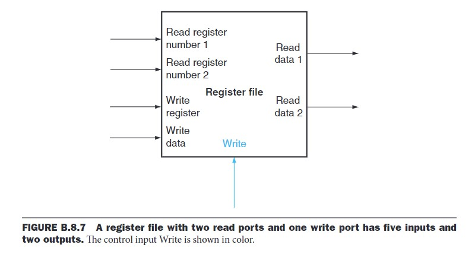
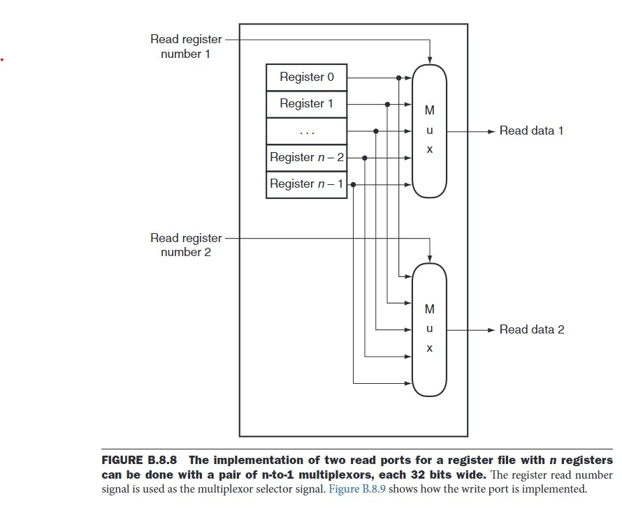
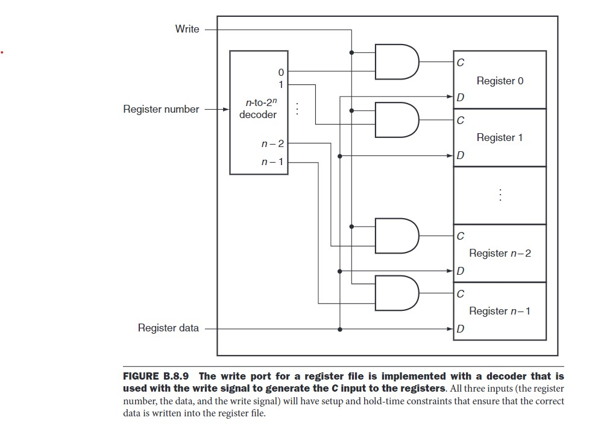

# Register

## What is a Register

A **register** in a processor is a small, fast storage unit used to temporarily hold data, instructions, or addresses during execution. Registers enable quick data access, reducing the need to fetch data from slower memory (RAM or cache).

In real-world processors, **registers** are not built separately but are integrated within the **Register File**.

A **Register File** is a sequential logic block (a memory element) used to store and provide fast access to multiple registers in a processor. 

It takes **register numbers** (including read and write registers) and **write data** as inputs, along with a **write signal** to control read and write operations. The output consists of the stored data from the selected registers during a read operation.

## How does a Register File work?

A Register File is built using flip-flops, all sharing the same control input line.

For example, in a Register File containing **8 registers**, each **32-bit wide**, every bit is stored in an individual flip-flop.

### Read Operation

For the **read ports**, the input consists of register numbers that specify which registers to read. These numbers act as selection signals for a **multiplexer**, which determines which register's data will be output.

### Write Operation

For the **write port**, the **data input line** connects to all registers. The **register number input** is passed through a **decoder** to generate a signal for the target register. This signal is then combined with the **write control signal** using an **AND gate** and connected to the **clock edge control signal** of each flip-flop, ensuring data is written at the correct moment.

