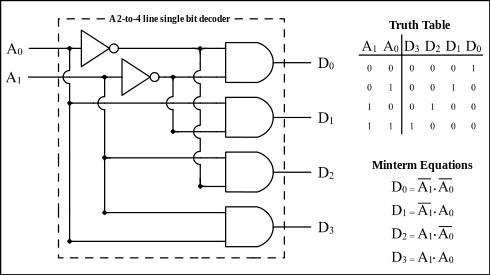

# Logic Circuit

## What is a Logic Circuit?
A Logic Circuit is a circuit that combines **[logic gates]** to process binary inputs and produce outputs. It can be:

- **Combinational Logic Circuit**: Outputs depend only on current inputs, implementing a logic function (e.g., ALU, multiplexer).

- **Sequential Logic Circuit**: Outputs depend on both current inputs and past states, using memory elements (e.g., flip-flops, registers).

Logic circuits are essential for digital systems, forming the core of processors, memory, and control units. 

## How Does a Logic Circuit Work?

**A Logic Circuit** takes binary inputs (as currents).
Then, through a combination of **[logic gates]** it produces outputs, changes its state (sequential logic).

## How to Build a Logic Circuit?

### Combinational Logic Circuit

**Combinational Logic Circuit** is created by combining/connecting **[logic gates]** follows a logic function (or a truth table)

#### Example: Building 2-to-4 decoder

A 2-to-4 decoder takes **2 inputs (A0, A1)** and produces **4 outputs (D0, D1, D2, D3)**.

##### Truth Table:

| A0 | A1 | D0 | D1 | D2 | D3 |
|----|----|----|----|----|----|
| 0  | 0  |  1 |  0 |  0 |  0 |
| 0  | 1  |  0 |  1 |  0 |  0 |
| 1  | 0  |  0 |  0 |  1 |  0 |
| 1  | 1  |  0 |  0 |  0 |  1 |

##### Logic Equations:
```
Y0 = NOT(A) AND NOT(B)
Y1 = NOT(A) AND B
Y2 = A AND NOT(B)
Y3 = A AND B
```

##### Form the circuit



### Sequential Logic Circuit

**Sequential Logic Circuits** involve **memory elements** that store information about past states. These circuits produce outputs based on both current inputs and the stored state (memory), unlike combinational circuits which only depend on current inputs.

#### Example: Building a Simple 1-Bit Memory Using Flip-Flops

In this example, we use a **D Flip-Flop** to build a simple 1-bit memory. A **D Flip-Flop** stores the value of the input **D** at each clock pulse and outputs it as **Q**.

##### Components:

1. **Logic Gate** (AND, OR, NOT gates) – for controlling the logic based on inputs.
2. **D Flip-Flop** – stores and remembers the state (Q).

##### Truth Table for D Flip-Flop:

| CLK | D | Q (Next State) |
|-----|---|----------------|
|  0  | 0 |       Q        |
|  0  | 1 |       Q        |
|  1  | 0 |       0        |
|  1  | 1 |       1        |

CLK = Clock edge signal

##### Logic for the Circuit:

- The **D Flip-Flop** is triggered by the clock signal.
- The input **D** is connected to some combination of logic gates that define its value based on other inputs.
  
##### Example Circuit: Toggling Memory

Let's create a simple **toggling memory circuit** that alternates the output every time the clock pulses.

1. **Input A** controls whether the memory should toggle.
2. The **D input** of the flip-flop is connected to the output of an **XOR gate** that takes the current state of **Q** and input **A**.

##### Logic Equations:

`D = Q XOR A`

- This means the memory will toggle between **0** and **1** depending on the input **A** and the previous state of **Q**.

##### Forming the Circuit:

- **Input A** is connected to an XOR gate, which takes the current state **Q** and the input **A** to determine the new state.
- The output **D** of the XOR gate is connected to the input of the **D Flip-Flop**.
- The clock signal **CLK** controls when the memory updates its value.

[logic gates]: ./LogicGate