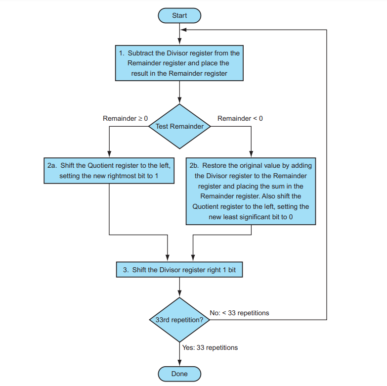
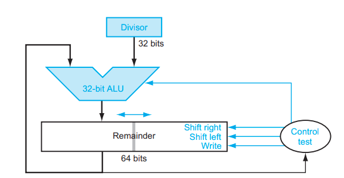

# Integer Division

## Terms

`Dividend` = `Quotient` x `Divisor` + `Remainder`

- `Dividend`: The number being divided.
- `Divisor`: The number by which the dividend is divided.
- `Quotient`: The result of the division (without the remainder).
- `Remainder`: The leftover part after division that cannot be evenly divided by the divisor.

Note: `Remainder` < `Divisor` and `Divisor` != 0

Example: 
17 ÷ 5 = 3 (Quotient) with a remainder of  2
17=(3×5)+2

## Grammar Schoor Algorithm

1. **Setup**: Arrange the dividend and divisor for long division.
2. **Divide**: Determine how many times the divisor fits into the current dividend segment.
3. **Multiply**: Multiply the divisor by the quotient from step 2.
4. **Subtract**: Subtract the product from the dividend segment.
5. **Bring Down**: Bring down the next digit of the dividend.
6. **Repeat**: Continue until all digits are used

Example: 1001010 / 1000 (base 10)

```
        | 1001 (quotient)
(divsor |--------
1000    | 1001010 (dividend)
         -1000
        ---------
             10
             101
             1010
            -1000
             -----
                10 (remainder)
```

## Division Algorithm and Hardware for Unsigned Integers

With unsigned integers, no overflow happens during division.

### 1. Basic version

#### Hard ware
For 32-bits unsigned integers division:
- 64 bits divisor register
- 64 bits remainder/dividend register
- 64 ALU
- 32 bits quotient register


### Algorithm

```cpp
// int
// - quotient = 0
// - divisor is put into most right 32-bits of divisor 64-bits register
// - dividened is put into most left 32-bits of remainder/dividend 64-bits register

// Loop (n+1) times for n-bits integer
for (i = 0; i < 33; i++) {
    // Subtract divisor from remainder
    remainder = remainder - divisor;

    if (remainder >= 0) {
        // If remainder is non-negative, shift quotient left and add 1
        quotient = (quotient << 1) | 1;
    } else {
        // If remainder is negative, restore it and shift quotient left, adding 0
        remainder = remainder + divisor;
        quotient = (quotient << 1) | 0;
    }

    // Shift divisor right by 1 bit
    divisor = divisor >> 1;
}
```



### Example

Let’s try dividing `7ten` by `2ten`, or `0111` by `0010`

| Iteration | Step                           | Quotient | Divisor     | Remainder   |
|-----------|--------------------------------|----------|-------------|-------------|
|           | Initial values                 | 0000     | 0010 0000   | 0000 0111   |
|-----------|--------------------------------|----------|-------------|-------------|
| 1         | Rem = Rem - Div                | 0000     | 0010 0000   | 1110 0111   |
|           | Rem < 0 => +Div, sll Q, Q0 = 0 | 0000     | 0010 0000   | 0000 0111   |
|           | Shift Div right                | 0000     | 0001 0000   | 0000 0111   |
| 2         | Rem = Rem - Div                | 0000     | 0001 0000   | 1111 0111   |
|           | Rem < 0 => +Div, sll Q, Q0 = 0 | 0000     | 0001 0000   | 0000 0111   |
|           | Shift Div right                | 0000     | 0000 1000   | 0000 0111   |
| 3         | Rem = Rem - Div                | 0000     | 0000 1000   | 1111 0111   |
|           | Rem < 0 => +Div, sll Q, Q0 = 0 | 0000     | 0000 1000   | 0000 0111   |
|           | Shift Div right                | 0000     | 0000 0100   | 0000 0111   |
| 4         | Rem = Rem - Div                | 0000     | 0000 0100   | 0000 0011   |
|           | 2a: Rem ≥ 0 => sll Q, Q0 = 1   | 0001     | 0000 0100   | 0000 0011   |
|           | Shift Div right                | 0001     | 0000 0010   | 0000 0011   |
| 5         | Rem = Rem - Div                | 0001     | 0000 0010   | 0000 0001   |
|           | 2a: Rem ≥ 0 => sll Q, Q0 = 1   | 0011     | 0000 0010   | 0000 0001   |
|           | Shift Div right                | 0011     | 0000 0001   | 0000 0001   |

### 2. Improved version

#### Hard ware
For 32-bits unsigned integers division:
- 32-bits divisor register
- 64-bits remainder/dividend and quotient register
- 32-bits ALU



### Algorithm

```cpp
// init
// - quotient = 0
// - divisor set to 32-bits register (will not changing during the execution )
// - dividend is set upper 32-bits of 64 bit register

for (i = 0; i <= 32; i++) {
    dividend_upper = dividend_upper - divisor;
    if (dividend_upper >= 0) {
        dividend = (dividend << 1) | 1;
    } else {
        dividend_upper = dividend_upper + divisor;
        dividend = dividend << 1;
    }
}
// The last loop we not shift left the remainder
// So we do a shift right of this here to adjust
dividend_upper = dividend_upper >> 1;

// result
// - remainder: most right 32-bits of 64-bits register
// - quotient: most left 32-bits of 64-bits register

```

### Example

Let’s try dividing `7ten` by `2ten`, or `0111` by `0010`

| Iteration | Divisor     | Dividend    |
|-----------|-------------|-------------|
|           | 0010        | 0000 0111   |
|-----------|-------------|-------------|
| 1         | 0010        | 0000 1110   |
| 2         | 0010        | 0001 1100   |
| 3         | 0010        | 0011 1000   |
| 4         | 0010        | 0001 1000   |
|           | 0010        | 0011 0001   |
| 5         | 0010        | 0001 0001   |
|           | 0010        | 0010 0011   |
| final     | 0010        | 0001 0011   |


=> Quotient = 0011 = 3 (ten) and Remainder = 0001 = 1 (ten)

## Signed Division

Signed division algorithm negates the quotient if the signs of the operands are opposite and 
makes the sign of the nonzero remainder match the dividend.

Example:

(+7) / (+2) = (+3) (remain +1)
(+7) / (-2) = (-3) (remain +1)
(-7) / (+2) = (-3) (remain -1)
(-7) / (-2) = (+3) (remain -1)

## Overlow

Overflow can occur in division, but it is rare compared to multiplication. Here's when it happens:

### In Signed Division
32 bit signed integer have range from -2^32 to 2^32 -1.
Therefor if we do the division: -2^32 / (-1) = 2^32 => the overflow will happen

### In Unsigned Division
Overflow does not occur in unsigned division because:
The result of dividing an n-bit unsigned number by another n-bit unsigned number always fits within n bits.

## Division in Different Hardware

The same registers used for multiplication are also used for division
