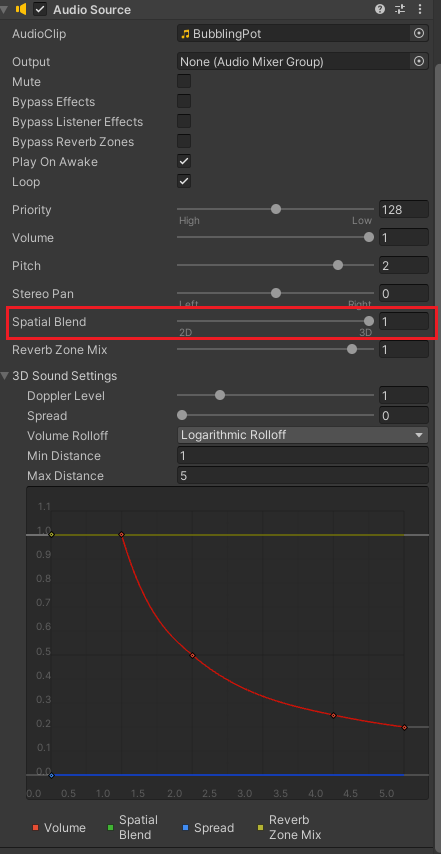
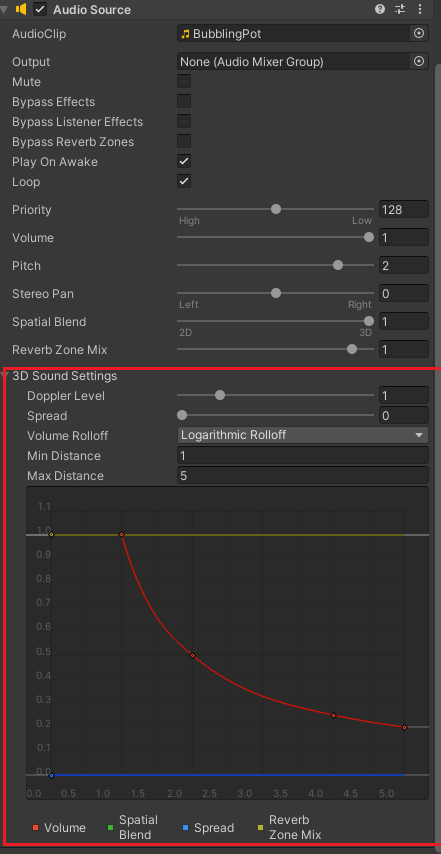

# Essentials of Audio

[Unity Learn Link](https://learn.unity.com/project/essentials-of-real-time-audio)

## Audio Listener

**Camera** acts as user's **eyes**.

**Audio Listener** acts as user's **ears**.

There is only 1 `Audio Listener` can be in a Scene!

Every default Unity Scene has an `Audio Listener` attacted to the `Main Camera` (So the user's eyes and ears are together)

## 3D Audio

In 3D Audio, `Audio Clips` sound differently depending on the location of the `Audio Listener` in the Scene

### Setting for 3D effect

To convert an `Audio Source` to 3D Audio, change the value of `Spatial Blend` property of `Audio Source` to `1`.

**Notes**: Background music's volumne will not change by the `Audio Listener` position and direction (no 3D effect) => set `Spatial Blend` to `0`

### Audio Rolloff

The `rolloff` of an audio clip defines its range in 3D space. 

When distance from player is greater than or equal the Max Distance, user will hear the sound with Min Volumne.

When distance from player is less than or equal the Min Distance, user will hear the sound with Max Volumne.

To change the `rolloff` of your sound, open up `3D Sound Settings` in `Audio Source` and change the value of `Volume Rolloff`, `Min Distance`, `Max Distance`.

Ex. Change `Volume Rolloff` to `Linear Rolloff`, `Min Distance` to `1` and `Max Distance` to `5` will make user only hear the sound of `Audio Source` when in range `1-5` units from the source

Ex. Change `Volume Rolloff` to `Logarithmic Rolloff` => when `Audio Listener` move out of range `Audio Source`, user can still hear the sound with min volumne (`0.1`) in the curve

**Notes**: You can define custom curve to achive `rolloff` setting you want.

## Audio Digital Creation tools (DCCs)

Audio Digital Creation tools (DCCs), such as **Audition**, Logic Pro, Reaper, and Audacity, allow artists to record, edit, and mix sound effects and music for a project.

In these programs, artists **record** and **compose** music to serve as background tracks; **clean up** and **restore** distorted or noisy recordings; add **filters** and **effects** to achieve a particular sound; and **optimize** audio to balance quality with performance.

